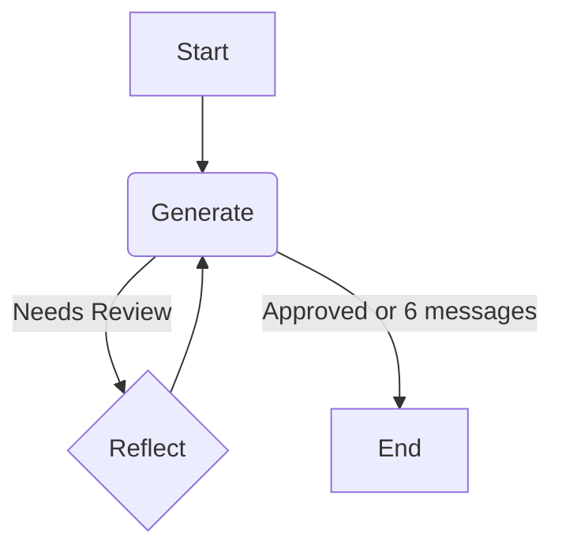

# Reflection Agent

This project uses LangGraph to create a conversational agent with a generate-reflect cycle. The primary agent is designed to generate and refine tweets based on user input and critiques using StateGraph for flexible state management.

#### This project seems to come from this source:
- https://blog.langchain.com/reflection-agents/


## Project Structure

-   `main.py`: The main entry point for running the agent.
-   `chains.py`: Defines the LangChain Expression Language (LCEL) chains for generation and reflection.
-   `pyproject.toml`: Contains the project dependencies.
-   `diagram.mmd`: A Mermaid diagram file that visualizes the agent's graph flow.

## Agent Flow

The agent uses StateGraph to manage message state through a generate-reflect cycle that continues until 6 messages are reached or the content is approved.



### Architecture Details

- **StateGraph**: Uses custom `GraphState` TypedDict to manage message history
- **Generation Node**: Creates Twitter posts using LangChain generation chain
- **Reflection Node**: Provides critiques and improvement suggestions
- **Conditional Logic**: Terminates after 6 messages or when content is approved

## Setup Instructions

Follow these steps to set up and run the project. All commands should be run from this directory (`reflection-agent`).

### 1. Create and Activate Virtual Environment

This project uses `uv` for package and environment management.

First, create the virtual environment:

```bash
uv venv
```

Then, activate it:

```bash
source .venv/bin/activate
```

### 2. Install Dependencies

Install the required Python packages. If you encounter build errors with editable install, use the alternative method:

```bash
# Method 1: Try editable install first
uv pip install -e .

# Method 2: If above fails, install dependencies directly
uv add langchain langchain-openai langgraph python-dotenv black isort grandalf
```

### 3. Set Up Environment Variables

The project requires an OpenAI API key.

First, copy the template file:

```bash
cp .env_template .env
```

Next, open the `.env` file in your editor and add your OpenAI API key:

```
OPENAI_API_KEY="sk-..."
```

## How to Run

To run the application, make sure your virtual environment is activated and execute the `main.py` script:

```bash
# Activate virtual environment
source .venv/bin/activate

# Run the application
python main.py
```

## Troubleshooting

### Common Issues

**ModuleNotFoundError: No module named 'langchain_core'**
- Ensure your virtual environment is activated: `source .venv/bin/activate`
- If dependencies aren't installed, use Method 2 from the Install Dependencies section

**OpenAI API Key Error**
- Verify your `.env` file contains a valid `OPENAI_API_KEY`
- Make sure you've copied `.env_template` to `.env` and filled in your API key

**Build errors during installation**
- Use the direct dependency installation method: `uv add langchain langchain-openai langgraph python-dotenv black isort grandalf`
